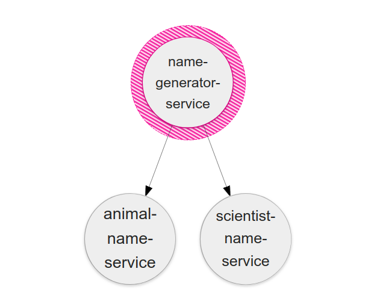
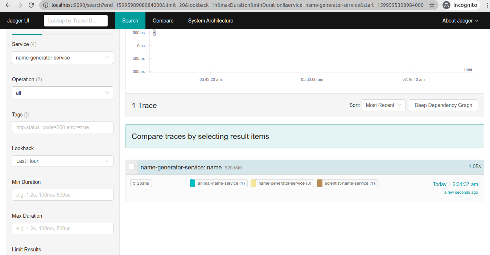
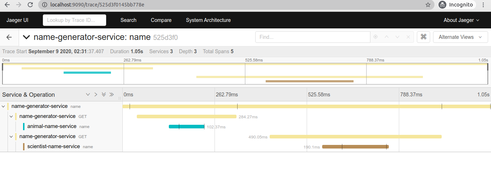

# Jaeger integration with spring boot application

#### Let's first understand what is Jaeger

Jaeger is open source software for tracing transactions between distributed services.
It’s used for monitoring and troubleshooting complex microservices environments.

> Ridesharing company Uber developed Jaeger as an open source project in 2015. It was accepted as a Cloud Native Computing Foundation (CNCF) Incubation project in 2017 and promoted to graduated status in 2019.


#### What is distributed tracing?

Distributed tracing is a way to see and understand the whole chain of events in a complex interaction between microservices.

Modern, cloud-native software development relies on microservices: independent services that each provide a different core function. When a user makes a request in an app, many individual services respond to produce a result.

A single call in an app can invoke dozens of different services that interact with each other. How can developers and engineers isolate a problem when something goes wrong or a request is running slow? We need a way to keep track of all the connections.

That’s where distributed tracing comes in. It’s often run as part of a service mesh, which is a way to manage and observe microservices.

Jaeger uses distributed tracing to follow the path of a request through different microservices. Rather than guessing, we can see a visual representation of the call flows.

Organized information about transactions is useful for debugging and optimization. Jaeger includes tools to monitor distributed transactions, optimize performance and latency, and perform root cause analysis (RCA), a method of problem solving.

#### Jaeger terminology and components

Jaeger presents execution requests as **traces**. A trace shows the data/execution path through a system. 

A trace is made up of one or more **spans**. A span is a logical unit of work in Jaeger. Each span includes the operation name, start time, and duration. Spans may be nested and ordered.

Jaeger includes several components that work together to collect, store and visualize spans and traces.

**Jaeger Client** includes language-specific implementations of the OpenTracing API for distributed tracing. These can be used manually or with a variety of open source frameworks.

**Jaeger Agent** is a network daemon that listens for spans sent over User Datagram Protocol. The agent is meant to be placed on the same host as the instrumented application. This is usually implemented through a sidecar in container environments like Kubernetes.

**Jaeger Collector** receives spans and places them in a queue for processing.

Collectors require a persistent storage backend, so Jaeger also has a pluggable mechanism for span **storage**. 

**Query** is a service that retrieves traces from storage.

**Jaeger Console** is a user interface that lets you visualize your distributed tracing data.

#### Why Jaeger?

As on-the-ground microservice practitioners are quickly realizing, the majority of operational problems that arise when moving to a distributed architecture are ultimately grounded in two areas: networking and observability. It is simply an orders of magnitude larger problem to network and debug a set of intertwined distributed services versus a single monolithic application.

#### Jaeger in Action

We will be integrating jaeger on a spring boot applications.

First,Let's quickly setup our spring boot applications.

The idea here is generating names by concatenating famous scientists name with animal names.
So,We will build 3 microservices using spring boot i.e ``animal-name-service`` , ``name-generator-service``
and ``scientist-name-service``.

Client Request for a scientist and animal concatenated name from ``name-generator-service`` which internally calls ``animal-name-service`` and ``scientist-name-service``.
Same is demonstrated in the below diagram.




Let’s quickly build our three Microservices using [spring initializer](https://start.spring.io/).

We will add ``spring-boot-starter-web``  dependency while generating spring boot application.
Now we have 3 spring boot applications ready. Let's add these 3 microservices to a folder named opentracing-microservices-example.
And open this folder in your favourite editor.I use intellij.

As we have to call ``animal-name-service`` and ``scientist-name-service`` from ``name-generator-service``
we are choosing feign client for this. So let's add ``spring-cloud-starter-openfeign:2.2.3.RELEASE`` dependency in ``name-generator-service``.

Here is the code for all 3 microservices.

AnimalNameService:

```java
package com.example.ans;

  import org.springframework.boot.SpringApplication;
  import org.springframework.boot.autoconfigure.SpringBootApplication;
  import org.springframework.core.io.ClassPathResource;
  import org.springframework.http.HttpHeaders;
  import org.springframework.web.bind.annotation.GetMapping;
  import org.springframework.web.bind.annotation.RequestHeader;
  import org.springframework.web.bind.annotation.RequestMapping;
  import org.springframework.web.bind.annotation.RestController;

  import java.io.BufferedReader;
  import java.io.IOException;
  import java.io.InputStream;
  import java.io.InputStreamReader;
  import java.util.List;
  import java.util.Random;
  import java.util.stream.Collectors;

  @SpringBootApplication
  public class AnimalNameService {

      public static void main(String[] args) {
          SpringApplication.run(AnimalNameService.class, args);
      }

  }

  @RestController
  @RequestMapping("/api/v1/animals")
  class AnimalNameResource {

      private final List<String> animalNames;
      private Random random;

  

public AnimalNameResource() throws IOException {
          InputStream inputStream = new ClassPathResource("/animals.txt").getInputStream();
          try (BufferedReader reader = new BufferedReader(new InputStreamReader(inputStream))) {
              animalNames = reader.lines().collect(Collectors.toList());
          }
          random = new Random();
      }
      

      @GetMapping(path = "/random")
      public String name(@RequestHeader HttpHeaders headers) {
          String name = animalNames.get(random.nextInt(animalNames.size()));
          return name;
      }

  }

```

application.properties :

```properties
server.port=9000
```


NameGeneratorService:

Here, I am using ``com.shekhargulati:strman:0.4.0`` library for converting animal and scientist name to kebab case.

```java
package com.example.ngs;


import org.springframework.beans.factory.annotation.Autowired;
import org.springframework.boot.SpringApplication;
import org.springframework.boot.autoconfigure.SpringBootApplication;
import org.springframework.cloud.openfeign.EnableFeignClients;
import org.springframework.cloud.openfeign.FeignClient;
import org.springframework.web.bind.annotation.GetMapping;
import org.springframework.web.bind.annotation.RequestMapping;
import org.springframework.web.bind.annotation.RestController;

import static strman.Strman.toKebabCase;

@SpringBootApplication
@EnableFeignClients
public class NameGeneratorService {

    public static void main(String[] args) {
        SpringApplication.run(NameGeneratorService.class, args);
    }

}


@FeignClient(name = "scientist-service-client", url = "${scientist.service.prefix.url}")
interface ScientistServiceClient {

    @GetMapping("/api/v1/scientists/random")
    String randomScientistName();

}

@FeignClient(name = "animal-service-client", url = "${animal.service.prefix.url}")
interface AnimalServiceClient {

    @GetMapping("/api/v1/animals/random")
    String randomAnimalName();

}


@RestController
@RequestMapping("/api/v1/names")
class NameResource {

    @Autowired
    private AnimalServiceClient animalServiceClient;
    @Autowired
    private ScientistServiceClient scientistServiceClient;


    @GetMapping(path = "/random")
    public String name() throws Exception {
        String animal = animalServiceClient.randomAnimalName();
        String scientist = scientistServiceClient.randomScientistName();
        String name = toKebabCase(scientist) + "-" + toKebabCase(animal);
        return name;
    }


}
```

application.properties :

```properties
server.port=8080
scientist.service.prefix.url=http://localhost:8090
animal.service.prefix.url=http://localhost:9000
```


ScientistNameService:

```java
package com.example.sns;

import org.springframework.boot.SpringApplication;
import org.springframework.boot.autoconfigure.SpringBootApplication;
import org.springframework.core.io.ClassPathResource;
import org.springframework.http.HttpHeaders;
import org.springframework.web.bind.annotation.GetMapping;
import org.springframework.web.bind.annotation.RequestHeader;
import org.springframework.web.bind.annotation.RequestMapping;
import org.springframework.web.bind.annotation.RestController;

import java.io.BufferedReader;
import java.io.IOException;
import java.io.InputStream;
import java.io.InputStreamReader;
import java.util.List;
import java.util.Random;
import java.util.stream.Collectors;

@SpringBootApplication
public class ScientistNameService {

    public static void main(String[] args) {
        SpringApplication.run(ScientistNameService.class, args);
    }

}


@RestController
@RequestMapping("/api/v1/scientists")
class ScientistNameResource {

    private final List<String> scientistsNames;
    private Random random;
    
    public ScientistNameResource() throws IOException {
        InputStream inputStream = new ClassPathResource("/scientists.txt").getInputStream();
        try (BufferedReader reader = new BufferedReader(new InputStreamReader(inputStream))) {
            scientistsNames = reader.lines().collect(Collectors.toList());
        }
        random = new Random();
    }
    
    @GetMapping(path = "/random")
    public String name(@RequestHeader HttpHeaders headers) {
        String name = scientistsNames.get(random.nextInt(scientistsNames.size()));
        return name;
    }

}


```

application.properties :

```properties
server.port=8090
```


Now we will run all 3 application and go to ``http://localhost:8080/api/v1/names/random`` in browser.

We will get some random name example : john-cockcroft-snapping-turtle

So Now our application setup is done.


*Now let's integrate jaeger to these applications so that we can trace each request.*


We just need to add below dependency to all 3 pom.xml. 

```xml
		<dependency>
			<groupId>io.opentracing.contrib</groupId>
			<artifactId>opentracing-spring-jaeger-cloud-starter</artifactId>
			<version>3.1.2</version>
		</dependency>
```


And we need to add below properties in application.properties file for all 3 applications.

```properties
spring.application.name=<name-of-the-application>  // example : name-generator-service (this will be displayed in jaeger for respective service)
opentracing.jaeger.udp-sender.host=localhost //udp host for sender. By default Jaeger libraries use a UDP sender to report finished spans to the jaeger-agent daemon
opentracing.jaeger.udp-sender.port=6831 // udp port
opentracing.jaeger.log-spans=true // logs the spans in console
```

Run Jaeger in docker via below command :

```bash
docker run -p 9090:16686 --name jaeger -d jaegertracing/all-in-one:1.17
```

 Now restart the application. And go to localhost:9090 in browser. We will get jaeger homepage.
 Also,  go to ``http://localhost:8080/api/v1/names/random`` in browser. Similarly you will get some random name.
 But now we can trace the request. Check in jaeger dashboard choose service ``name-generator-service``
 then click on find traces. we will get traces as shown in below image for the ``name-generator-service``.




 We can clearly see that there are 5 spans when we drill down on this. 

 name-generator-service(1 span)
 name-generator-service->animal-name-service(2 spans)
 name-generator-service->scientist-name-service(2 spans)

This is shown in below image.



I have added Dockerfile,docker-compose and docker-setup.sh for making it easier to run this application.
You can find the code at my github repository [link](https://github.com/himankbatra/opentracing-microservices-example).

This is inspired by Shekhar Gulati's [Blog]  (https://shekhargulati.com/2019/04/08/a-minimalistic-guide-to-distributed-tracing-with-opentracing-and-jaeger/).

